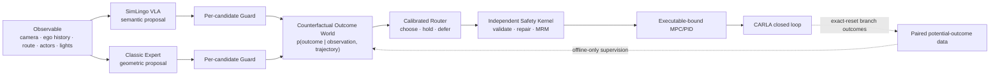

# SafeDrive Foundry

SafeDrive Foundry 是面向单机 CARLA–ROS 2 软件在环的安全混合驾驶研究项目。项目把预训练
SimLingo VLA 与 Classic Frenet/ST Expert 作为两个独立、互补的轨迹提议器；逐候选 Guard
先过滤合同和明显风险，candidate-conditioned World 预测候选后果并在证据不足时 defer，
最终由独立 Safety Kernel 与 MPC/PID 保留执行权。

当前结题主线命名为：

> **CORA-Drive：面向混合 VLA–Expert 驾驶的反事实后果世界模型与可校准安全路由**

```text
VLA proposes → World predicts consequences → calibrated routing may abstain
             → Safety retains final authority → MPC/PID executes
```



## 当前结论

```text
H0 = VERIFIED / STOPPED
H1 = VERIFIED / STOPPED
H2 = VERIFIED / GATE_PASSED / STOPPED
H3 = VERIFIED / GATE_PASSED / STOPPED
H4 = VERIFIED / GATE_PASSED / STOPPED
H5 = VERIFIED / GATE_FAILED / STOPPED
H6 v1/v2 = IMPLEMENTED / MEASURED / NOT_VERIFIED
H6-CORA program = IN_PROGRESS（C0 COMPLETED，C1 CURRENT）
H6-CORA algorithm Evidence = PLANNED
Online Oracle = PROHIBITED
```

这里有两个不同维度：`program` 表示结题工作走到哪一步，`Evidence` 表示新算法是否已有可引用
结果。完成文档 C0、开始正确性 C1，不会把尚未采集/训练/评测的 CORA 算法升级为
`IMPLEMENTED` 或 `MEASURED`。

H3/H4 的小型离线集显示 World 能区分候选，但 H5 的 222 次 closed-loop run（74 个 paired
scenario roots）
没有证明可复现净收益：样本内 `ON-only unsafe=0`，但这不是统计安全证明；route-progress
差异的 bootstrap 95% 下界仍小于 0，延迟和切换也未全部过门。H6 seed 101 pilot 的 600
tick 中，World strict VLA preference
只有 `21.83%`，实际 VLA 使用 `47.50%`；另有 10/600 tick 缺 World pair score 并触发
provenance gate，因此不能声明 H6 成功。

后续不再以“让 World 90% 偏爱 VLA”作为优化目标。H6-CORA 先修复两个实现正确性阻塞：
虚假/占位 validation 与 loss/readiness 语义，以及多 tick-owner 风险；再解决四个研究根因：

1. logged tick 缺少未执行候选的反事实 outcome；
2. World 可能学习 source/slot/episode shortcut，而不是候选后果；
3. 未校准 selector 在证据不足时仍被迫二选一；
4. offline calibration 与 live temporal state 可能不一致。

新的主要结果看 counterfactual outcome quality、pairwise regret、risk-coverage、defer、闭环
安全/进度、切换和实时性；VLA/Classic 使用率只作为诊断结果报告。

`defer` 在本项目中不是“停止输出”或调用在线 Oracle：它把排序权交回冻结的非学习回退规则，
优先保持仍 eligible 的当前 source，否则按 Expert→VLA→MRM 检查，并始终重新经过 Safety。

## 权威入口

1. [START_TASK.md](START_TASK.md)：当前唯一工程任务、允许路径、验收和停止点。
2. [ROADMAP.md](ROADMAP.md)：H0–H6 冻结状态及 H6-CORA 结题子阶段。
3. [PROGRESS.md](PROGRESS.md)：已确认事实，不保存未测量的正向宣称。
4. [PROJECT](docs/PROJECT.md)：研究问题、系统边界和最终贡献。
5. [HYBRID_CANDIDATES](docs/HYBRID_CANDIDATES.md)：VLA/Expert、Guard 和执行身份合同。
6. [COUNTERFACTUAL_DATA](docs/COUNTERFACTUAL_DATA.md)：同锚点双分支 potential-outcome 数据合同。
7. [WORLD_MODEL](docs/WORLD_MODEL.md)：CORA outcome model、loss、calibration 和 router 合同。
8. [RELATED_WORK](docs/RELATED_WORK.md)：VLA、World Model、反事实与选择性决策的前沿定位。
9. [SHOWCASE](docs/SHOWCASE.md)：简历、演示和面试主干—枝干叙事。
10. [ENVIRONMENT](docs/ENVIRONMENT.md)、[RESOURCES](docs/RESOURCES.md)、
    [EVIDENCE](docs/EVIDENCE.md)：运行、预算和证据真源。

推荐阅读路径：面试准备按 README→SHOWCASE→PROJECT→EVIDENCE；工程接管按
START_TASK→PROGRESS→任务直接引用的合同；复现实验先读 ENVIRONMENT→RESOURCES→EVIDENCE。
不要从归档 handoff 开始。

阶段性交付、旧 handoff 和旧 H2 合同已移入
[`archive/2026-08-27-cora-document-consolidation/`](archive/2026-08-27-cora-document-consolidation/README.md)。
归档不是活动需求来源。

## 固定边界

- 仅限 CARLA 软件在环，不涉及实车、公共道路或生产控制。
- Windows 运行 CARLA Server；WSL2 运行 ROS 2、客户端、模型和训练。
- 固定硬件为 RTX 4080 16GB 与 i5-13600KF。
- Classic Expert 与 nominal VLA 各自独立提出一条轨迹；在线学习模块不得伪造第二候选。
- Guard 在 World 之前逐候选执行；World 不得生成轨迹或覆盖 Safety。
- Oracle、rollout future、Regression 和场景答案只允许离线标注/审计。
- World 在线输入保持 metadata-source-blind；source 只用于 provenance 和分层报告，轨迹风格
  可预测性另做诊断。
- 所有正式失败、负收益、deadline miss 和资源限制原样保留。

## 最小检查

```bash
cd "/mnt/e/autonomous driving"
source /home/sdf/.venvs/sdf/bin/activate
python -m unittest discover -s tests -t . -v
python -m compileall -q safedrive_foundry scripts tests
git diff --check
```

真实 CARLA 任务还必须先运行：

```bash
python scripts/sdf.py sim preflight --json
```

某个受限代理进程无法看到 GPU/CARLA 只能解释为该进程的访问结果，不能据此否定本机资产；
正式任务仍必须在实际执行环境中以 preflight、CUDA probe 和运行 Evidence 证明可用。
