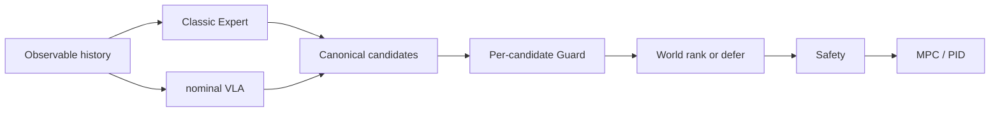

# SafeDrive Foundry

SafeDrive Foundry 是面向单机 CARLA–ROS 2 软件在环研究的 Hybrid 驾驶项目。活动项目
只使用 H 路线：Classic Expert 与 nominal VLA 独立提议轨迹，逐候选 Guard 先过滤，
candidate-conditioned World 只负责排序或 defer，最终由 Safety 与 MPC/PID 执行。



当前状态：`H0 VERIFIED / H1 VERIFIED / H2 GATE_PASSED / H3 GATE_PASSED /
H4 GATE_PASSED / H5 GATE_FAILED / STOPPED`。
H3v2 已基于冻结 H2 数据与新采集的 96 场真实 CARLA Challenge 数据完成嵌套 OOF
训练与验收，最终 Evidence 为 `docs/runtime-evidence/h3/h3-v2-20260815d-final/`。
H4 locked evaluation 已完成盲测，Evidence 为
`docs/runtime-evidence/h4/h4-locked-20260816-final/`。
H5 完整闭环 on/off 已执行 222 runs，最终 Evidence 为
`docs/runtime-evidence/h5/h5-pilot-all2/final-delivery.json`，结果为 `GATE_FAILED`，
World 闭环收益不可复现。在线 Oracle 仍被禁止。

## 从这里开始

1. 读取 [START_TASK.md](START_TASK.md)，只执行当前任务。
2. 用 [ROADMAP.md](ROADMAP.md) 查看 H0–H6 顺序。
3. 用 [PROGRESS.md](PROGRESS.md) 查看已确认事实。
4. 设计边界见 [PROJECT](docs/PROJECT.md)、[Hybrid candidates](docs/HYBRID_CANDIDATES.md)、
   [Paired outcomes](docs/PAIRED_OUTCOMES.md) 与 [World](docs/WORLD_MODEL.md)。
5. 环境、资源、证据分别见 [ENVIRONMENT](docs/ENVIRONMENT.md)、
   [RESOURCES](docs/RESOURCES.md)、[EVIDENCE](docs/EVIDENCE.md)。
6. H3 完整交付与实施记录见 [H3_DELIVERY_REPORT](docs/H3_DELIVERY_REPORT.md)。
7. H4 完整交付与实施记录见 [H4_DELIVERY_REPORT](docs/H4_DELIVERY_REPORT.md)。
8. H5 进入检查见 [H5_ENTRY](docs/H5_ENTRY.md)。
9. H5 实验矩阵见 [H5_EXPERIMENT_MATRIX](docs/H5_EXPERIMENT_MATRIX.md)。
10. H5 最终负结果见 [PROGRESS](PROGRESS.md) 与 `docs/runtime-evidence/h5/h5-pilot-all2/`。

## 固定边界

- 仅限 CARLA 软件在环；不涉及实车、公共道路或生产控制。
- Windows 运行 CARLA Server，WSL2 运行 ROS 2、客户端、模型和训练。
- 固定硬件为 RTX 4080 16GB 与 i5-13600KF。
- 两个候选必须来自独立生成器，不能由 learned head 从同一轨迹扰动伪造多样性。
- Guard 在 World 之前逐候选执行；World 不得覆盖 Safety。
- Oracle、特权未来与 Regression 只用于离线标注/验收。
- `archive/` 只用于历史恢复，不能作为新任务来源。

## 最小离线检查

```bash
cd "/mnt/e/autonomous driving"
source /home/sdf/.venvs/sdf/bin/activate
python -m unittest discover -s tests/hybrid -t . -v
python -m compileall -q safedrive_foundry
git diff --check
```

真实 CARLA 任务必须先运行：

```bash
python scripts/sdf.py sim preflight --json
```
