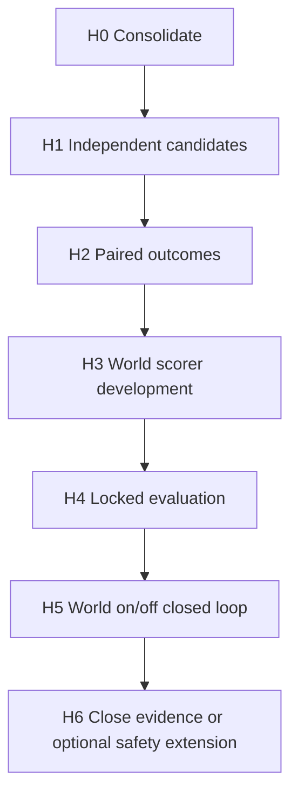

# SafeDrive Foundry H 路线

唯一活动路线是 H0–H6。每个阶段只能在前一阶段验收后开始；任何失败或无选择空间都
必须保留为结果，不能通过改名、降低门槛或生成相似候选绕过。

## 总体结构



| 阶段 | 交付物 | 硬门 |
|---|---|---|
| H0 | H-only 入口、可恢复归档、nominal VLA 回归 | 活动树无旧路线依赖 |
| H1 | Expert 与 VLA 各一条独立候选；逐候选 Guard | 同帧、同坐标、provenance、可执行 |
| H2 | paired outcome 数据与离线 Oracle 标签 | 足够 distinct、comparable、decisive |
| H3 | 共享 candidate-conditioned World scorer | 优于无动作与简单动力学/奖励基线 |
| H4 | 锁定 split、阈值、checkpoint 后盲测 | 不读测试标签，不调门 |
| H5 | 同候选集 World on/off 闭环 A/B | 安全不退化且效率/完成率有净收益 |
| H6 | 冻结结论、失败和资源；可选 Safety 扩展 | 研究 claim 与工程 claim 分开 |

## H0 — 收敛

- 只保留活动 H 文档和可复用 runtime；
- 旧候选生成、旧 World 数据/模型、阶段脚本、配置、测试和 Evidence 进入只读归档；
- 保留工作树 patch、untracked tar、hash 和恢复说明；
- 不把历史数值重新解释成 H 结果。

关闭状态：`H0_CONSOLIDATED`。

## H1 — 独立 HybridCandidateSet

同一 observable anchor 生成：

```text
candidate[expert] = Classic Expert(observation, route)
candidate[vla]    = nominal VLA(front image, route, ego state)
```

两者统一为 `T=10, dt=0.25 s, horizon=2.5 s`，保留 source、model/config hash、
observation/frame id 和生成时延。Guard 对每条候选独立判定；拒绝理由不能被 World
消除。若仅一条通过则直接交给 Safety；零条通过则触发既有安全回退。

H1 不训练新候选生成器，不允许从 nominal 轨迹做 learned perturbation 充当第二来源。

## H2 — Paired outcomes

- 从同一 anchor 分别强制执行 expert 与 VLA 候选；
- 保存实际执行轨迹、actor future、事件、进度、舒适性与 provenance；
- Oracle 只从 rollout outcome 生成离线排序标签，在线不可导入；
- 先验证选择空间，再扩大采集。

硬门至少包括：两候选不是重复轨迹、均有可执行样本、paired reset 可比、胜负不是单边
塌缩、标签不由候选槽位或 source id 泄漏。无选择空间则关闭 World 训练。

## H3 — World scorer development

World 对每个通过 Guard 的候选应用共享 scorer：

```text
score_i, predicted_outcome_i = World(observable_history, route, candidate_i)
```

输入不能含 Oracle、真实 future、候选最终结果或场景答案。输出只用于排序/defer。
必须做 candidate swap、slot permutation、action masking、history masking，并与 no-action、
CV/CTRV、手写 reward 及简单 MLP 基线比较。只有 candidate conditioning 真正有用且
跨 split 泛化才进入 H4。

## H4 — Locked evaluation

- 在训练前冻结开发/测试分组、阈值、seed、checkpoint 与评估脚本；
- test family/map/lineage 隔离；
- 报告 AUROC/accuracy 之外，还报告 regret、calibration、defer coverage、两来源胜率、
  P50/P95/P99 延迟和显存；
- World 若不优于简单基线，结论为负并停止，不进入在线控制。

## H5 — World on/off

同一个通过 Guard 的候选集、相同 Safety、控制器和场景，只替换 selector：

- off：冻结的非学习 selector；
- on：H4 冻结的 World scorer；
- defer：World 置信不足时回到 off selector，不得自行放宽 Guard/Safety。

主结论看闭环碰撞/违规、路线完成、进度、舒适、接管/回退、deadline miss 与资源。
只有安全不退化且任务收益可复现，才能声明 World 有用。

## H6 — 关闭

冻结正结果、负结果、失败尝试、配置、hash、资源和限制。完整 Safety 能力是可选独立
工程扩展，不作为 World 排序有效性的前置条件，也不能被学习模块修改。

## 方法依据

- [SimLingo (CVPR 2025)](https://arxiv.org/abs/2503.09594) 支持保留真实视觉语言动作
  模型作为 nominal 来源，而不是另训一个候选 head。
- [PDM / tuPlan Garage (CoRL 2023)](https://arxiv.org/abs/2306.07962) 展示了强规则
  planner 与学习模块分工的 Hybrid 路线，并强调闭环与开环目标不能混为一谈。
- [World4Drive (ICCV 2025)](https://openaccess.thecvf.com/content/ICCV2025/html/Zheng_World4Drive_End-to-End_Autonomous_Driving_via_Intention-aware_Physical_Latent_World_Model_ICCV_2025_paper.html)
  提供 world-model trajectory selector 的直接先例。
- [ACT-Bench](https://arxiv.org/abs/2412.05337) 表明视觉真实不等于动作条件忠实，因此
  H3 把 action swap/permutation 作为硬门。
- [nuPlan metrics](https://github.com/motional/nuplan-devkit/blob/master/docs/metrics_description.md)
  支持同时报告碰撞、drivable-area compliance 与 route progress，而不是只看模仿误差。

这些文献支持模块分工与验证方式，不构成本仓库 H 结果；本项目结论必须来自自己的
冻结 Evidence。
