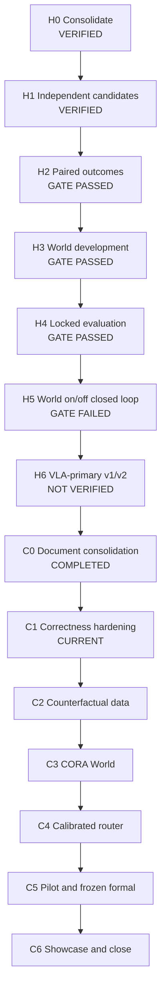

# SafeDrive Foundry 结题路线

唯一活动研究链仍是 `H0 → H1 → H2 → H3 → H4 → H5 → H6`。H0–H5 已冻结，H6-CORA
是 H6 的最终结题修订，不创建新的平行路线，不从 `archive/` 恢复旧任务。

## 1. 总路线与当前状态



| 阶段 | 状态 | 已冻结结论/交付物 |
|---|---|---|
| H0 | VERIFIED / STOPPED | H-only 活动路线、可恢复归档、单机边界 |
| H1 | VERIFIED / STOPPED | 独立 Expert/VLA 候选、逐候选 Guard、身份链 |
| H2 | VERIFIED / GATE_PASSED / STOPPED | 120 terminal、108 valid/distinct、83 decisive paired outcomes |
| H3 | VERIFIED / GATE_PASSED / STOPPED | metadata-source-blind candidate-conditioned scorer 与开发消融 |
| H4 | VERIFIED / GATE_PASSED / STOPPED | 64 decisive locked test；小样本离线门通过 |
| H5 | VERIFIED / GATE_FAILED / STOPPED | 222 paired runs；未证明闭环净收益 |
| H6 v1/v2 | IMPLEMENTED / MEASURED / NOT_VERIFIED | seed 101 pilot 未达 World/VLA-primary gate；v2 只有代码、无正式验证 |
| H6-CORA program | IN_PROGRESS | C0 文档/QA 完成，C1 正确性加固为当前任务 |
| H6-CORA algorithm Evidence | PLANNED | 尚无 CORA paired data、checkpoint 或闭环结果 |

## 2. 结题研究问题

H3–H5 已回答：旧 World 没有在冻结 closed-loop gate 上证明可复现净收益。H6-CORA 不再问
“如何让 World 偏爱 VLA”，而问：

> 同一 observable anchor 上，使用两个候选各自的真实 potential outcome 进行 metadata-source-blind
> 反事实后果学习，并在不确定时拒绝决策，是否能降低选择 regret，并在独立 Safety 下取得
> 安全不劣的闭环效用？

这里的 outcome 估计对象不是“绕过 Safety 后原始轨迹会怎样”，而是冻结系统干预：

\[
Y_i = Y\!\left(do(\text{proposal}=\tau_i);\;\pi_{Guard},\pi_{Safety},\pi_{control}\right)
\]

即给定 Guard 已判定 eligible 的候选，冻结 single-candidate Safety/repair/MRM 和 controller
后，系统接受这条 proposal 会产生什么后果。采集 branch 禁止跨候选 fallback，避免 `Y_i`
依赖另一个候选；在线 fallback 作为单独 transition 记录。CORA 预测的是可部署组合的后果，
不把 learned World 当安全真值。

主指标：

```text
counterfactual outcome quality
pairwise/selective regret
risk calibration and risk-coverage
defer / switch / ping-pong
paired unsafe and route progress
P50/P95/P99 latency, deadline miss, GPU peak
reset/provenance integrity
```

VLA/Classic/MRM 使用率只报告，不作为训练 source preference 目标。

## 3. H6-CORA 子阶段

### C0 — 文档与任务收敛

状态：`COMPLETED`。

- 活动文档只保留当前权威定义、事实、下一任务、环境、资源、Evidence 和展示合同；
- H3/H4 报告、H5 进入/矩阵、旧 H6 handoff 与 H2 阶段合同进入日期归档；
- 冻结 H5/H6 负结果；
- 确立 CORA 主线与停止条件。

停止点：不改代码、不训练、不运行 CARLA。

### C1 — 正确性加固

状态：`CURRENT`，完整合同见 [START_TASK.md](START_TASK.md)。

- 删除硬编码 validation pass；
- 修复 per-sample multi-task / Group-DRO；
- 统一 offline/live temporal selector；
- 修复 source-key EMA、hysteresis、hold、emergency；
- 恢复 single tick owner 合同；
- 加强 summary/readiness/hash 真实性。

硬门：专项与全量测试通过；不产生新测量或自动进入 C2。

### C2 — 反事实 potential-outcome 数据

状态：`PENDING`。

- 复用 H2/H3 capture、exact reset、双分支 50-tick rollout；
- 同一 anchor 同时获得 `Y(VLA)` 和 `Y(Expert)`；
- 新增 offline-only 可行轨迹干预，补充 collision/red-light/offroad/delayed-brake hard cases；
- 冻结 train/val/calibration/formal lineage；
- 输出 pair coverage、reset、hash、source/slot permutation 和 risk-event 质量报告。

`240–360` 个有效 paired anchors 只是单机预算假设，不是充分样本量承诺。C2 必须分成
smoke、coverage pilot 和 frozen development 三段；按 root anchor 计算有效样本数，不能把两个
branch 或同 anchor interventions 当成独立样本扩充。具体矩阵、稀有事件下限、seed、阈值和
最大资源上限必须在 C2 `START_TASK.md` 中先冻结。

硬门：用于 pair loss 的样本两条候选 outcome 均有效；不满足则停止，不用 episode 第一拍
或 source-majority 标签补齐。

### C3 — CORA Counterfactual Outcome World

状态：`PENDING`。

- observable encoder + shared candidate encoder + cross-attention；
- per-candidate progress/completion/collision/red-light/offroad/comfort/feasibility distributions；
- pair-difference head；
- candidate-swap equivariance、metadata source-blindness、outcome/difference consistency；
- 正确 per-head mask 和 per-sample loss；
- three-seed ensemble、worst-group report；
- 与 simple rule、candidate-only MLP、旧 factual H6 World 对比。

pair-difference 必须由效用差或显式反对称化结构保证交换后变号，不能只靠 swap augmentation。
metadata-only probe 必须失败关闭；允许轨迹形状本身具有 planner 风格，但必须报告
trajectory-to-source 可预测性并证明模型没有只靠风格捷径。

硬门：真实 swap/metadata-source/action/context probes 通过；pairwise regret 和 risk
calibration 在冻结 development/locked 数据上优于预注册 baseline，否则冻结负结果并停止 C4。

### C4 — 可校准选择与拒绝

状态：`PENDING`。

- ensemble/aleatoric uncertainty；
- calibration-only residual/conformal bounds；
- utility lower/upper bounds；
- choose/hold/switch/defer 状态机；
- episode/route-scoped source-stable temporal state；
- offline/live trace parity；
- Guard 和 Safety 权限保持不变。

`hold` 保持 source、每 tick 仍使用 fresh candidate；`defer` 把排序交给冻结非学习 fallback，
不是在线 Oracle、人工接管、停止控制或隐式 source quota。两候选/多 outcome 同时做 coverage
claim 时，必须预注册报告 marginal 还是 joint coverage，避免把逐头覆盖率写成系统级覆盖率。

硬门：risk-coverage、defer-risk、switching、latency 和 parity 通过；统计 coverage 不能写成
全域功能安全保证。

### C5 — 多臂 closed-loop 验证

状态：`PENDING`。

预注册候选臂及唯一允许变化：

| 臂 | 候选与系统负载 | 选择器差异 |
|---|---|---|
| A | 双 generator 同负载，VLA 只 shadow | 始终请求当前 eligible Expert；失败仍走同一 Safety/fallback |
| B | 与 A 相同 | frozen factual H6 World |
| C | 与 A 相同 | 同一 CORA checkpoint，但强制二选一、不允许 learned abstention |
| D | 与 A 相同 | full CORA calibrated choose/hold/defer |

另外单独报告“真正关闭 VLA 的 Classic deployment-cost profile”，只比较资源，不混入 A–D
选择因果对照。这样 A–D 的 World 增益不会被不同 GPU 负载、候选生成或 Safety 配置混淆。

先运行冻结 12-scenario pilot；pilot 全门通过才运行正式矩阵。正式矩阵规模由 C5 任务在
运行前冻结，不能根据 pilot 结果挑 map/family/seed。

主成功口径：

- full CORA 相对 Classic 满足预注册 paired unsafe non-inferiority；原始事件数、CORA-only
  unsafe 和置信区间同时报告，不能只比较 `unsafe_D <= unsafe_A`；
- paired progress bootstrap lower-95 `>= 0`；
- selective regret 优于 factual World 和 no-abstention；
- 无无法解释的 deadline miss；
- switching/ping-pong、defer、资源与 provenance 通过冻结门。

无论 formal 正负都冻结结果，不改门、不补挑场景、不开启新模型支线。

### C6 — 展示与正式关闭

状态：`PENDING`。

- 三场景可审计 live demo 和预录后备；
- 架构、数据、模型、风险覆盖、闭环 CI、失败分析图；
- 环境/依赖/许可证/第三方 attribution；
- 可跟踪的精简 Evidence summaries 和一键 offline replay；
- 简历项目描述与五页面试讲稿；
- 更新 `PROGRESS.md` 为最终 VERIFIED 或冻结负结果并 `STOPPED`。

完成 C6 后项目结题，不自动启动生成式视频 World、VLA 微调、RL、第三候选或全 ROS 2
重构。

## 4. 全局停止规则

- 每个子阶段只在前一阶段通过后开始；
- 每个问题最多一次初始实现和两次实质差异修复；
- 发现数据泄漏、重叠未知修改、冻结 Evidence 冲突或第二 tick owner 立即停止；
- pilot 失败即冻结，不运行 full；
- formal 无论正负都结题；
- 不以工作量、代码量或接近阈值为理由降低科学门。

## 5. 明确非目标

- 不从头训练像素/视频生成 World Model；
- 不让 World 或 VLA 获得无约束底盘控制；
- 不训练 learned perturbation 伪造在线第二候选；
- 不用文本 CoT 代替 reasoning-action/outcome 干预验证；
- 不追求固定 VLA source usage；
- 不用 archive 数字、开发强制采样或随机模型 latency 冒充正式结果。
