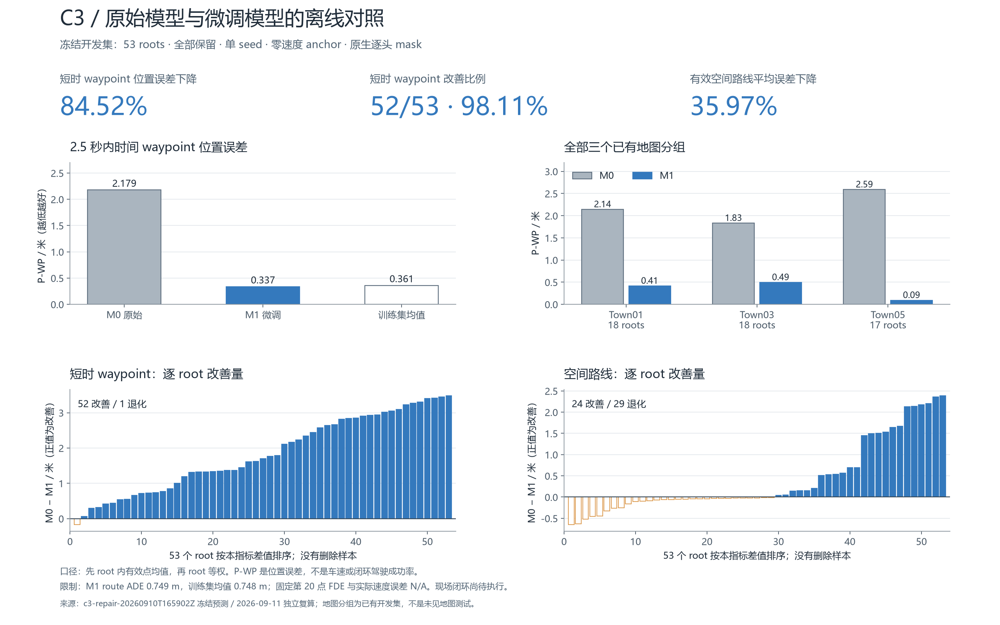

# C3 学校项目结果页：原始模型与微调模型

更新：2026-09-11。范围：冻结开发集上的离线对照；53 个 validation roots 全部保留。
原始模型 M0 与常规 LoRA 微调 M1 使用相同输入和真值 mask，逐 root 计算后等权平均。

**主要结果：短时 waypoint 位置误差下降 84.52%，52/53 个 root（98.11%）改善；
有效支持范围内的空间路线平均误差下降 35.97%。**



## 全量比较

| 指标 | M0 | M1 | 绝对改善 | 相对改善 |
|---|---:|---:|---:|---:|
| P-WP：0.25…2.5 s 时间 waypoint 位置误差 | 2.178557 m | 0.337217 m | 1.841340 m | 84.52% |
| P-ADE：有效空间路线误差 | 1.170243 m | 0.749253 m | 0.420989 m | 35.97% |
| 实际 canonical 转换有效率 | 53/53 | 53/53 | 无变化 | 无变化 |
| 非有限/形状错误/转换失败 | 0/53 | 0/53 | 无变化 | 无变化 |
| 固定第 20 点 P-FDE | N/A | N/A | 无足够真值支持 | — |
| 实际速度误差 P-SPEED | N/A | N/A | 无可信匹配速度真值 | — |

P-WP 是以米计的轨迹位置误差，不是车速误差或闭环成功率。52/53 是本次开发集的改善比例，
不是驾驶成功率，也不是多 seed 稳定性。P-WP 是此次看到 C3 结果后确定的结题展示重点；
旧实验记录不回写。C4 将在正式 M2 前登记新主指标版本。

配对 root bootstrap 1000 次、seed 71：P-WP 绝对下降的 95% 区间为 [1.544037, 2.118425] m，
P-ADE 为 [0.198652, 0.638851] m。区间仅描述当前开发 roots，不包含训练随机性或新场景泛化。

## 改善的覆盖范围

P-WP 在全部三个已有地图分组、全部九个已有场景类别的均值都下降，未按模型误差筛掉样本。

| 地图 | roots | M0 P-WP | M1 P-WP | 下降 |
|---|---:|---:|---:|---:|
| Town01 | 18 | 2.139864 m | 0.413649 m | 80.67% |
| Town03 | 18 | 1.831026 m | 0.493654 m | 73.04% |
| Town05 | 17 | 2.587502 m | 0.090651 m | 96.50% |

所有九类场景及 route 退化见 [完整分组与收尾方案](C3_C4_FINISH_PLAN.md)。这些是已有
开发数据中的分组，不是未见地图测试。全部样本为零速度 anchor，非零初速能力尚未验证。

## 简单基线与保留限制

| 同一有效支持上的诊断 | 基线 | M1 | 解释 |
|---|---:|---:|---|
| 训练集均值 P-WP | 0.360589 m | 0.337217 m | M1 约低 6.48%，小于相对 M0 的改善幅度 |
| 训练集均值 route ADE（691 点） | 0.748091 m | 0.749253 m | 基本持平，M1 略差 |
| 导航几何 route ADE（共同 433 点） | 0.061733 m | 0.107689 m | M1 尚未超过简单导航；此范围 M0 为 0.089937 m |

route 改善 24/53、退化 29/53；P-WP 改善 52/53、退化 1/53，完整逐 root 记录均保留。
route 的支持中位数约 13.27 m、最大约 15.98 m，未外推为完整 19 m。
这些结果支持当前数据上的示范适配效果，不直接证明现场驾驶性能或 C4 World 方法增益。

## 已交付内容与本次修正

### 补充：0.1 米工程容差敏感性分析（事后提出）

用户在查看当前结果后提出 0.1 m 容差。仅作为开发集描述性分析：令差值为 M0 route ADE
减 M1 route ADE，保留原始数值；大于 0.1 m 为超出容差的改善，[-0.1, 0.1] m 为容差内，
小于 -0.1 m 为超出容差的退化。全部 53 roots 保留，没有更改原指标或数值容差。

| 按 0.1 m 容差划分 | roots | 比例 |
|---|---:|---:|
| 改善超过 0.1 m | 22 | 41.51% |
| 差异在 ±0.1 m 内 | 21 | 39.62% |
| 退化超过 0.1 m | 10 | 18.87% |
| 没有超过 0.1 m 的退化（前两项合计） | 43 | 81.13% |

原 29 个退化 roots 中，19 个的误差增加不超过 0.1 m。81.13% 表示采用该容差时未发生
更大退化的比例，不是严格改善比例，也不证明统计等效或闭环安全。0.1 m 尚无测量噪声
依据；旧实验数值阈值 `eps_ADE=1e-5 m` 保持原样。将所有差值加 0.1 m 后再计正值，只能
解释为相对该容差边界的余量，不能替换原始改善量。

本机逐 root 分类及源文件身份：
`generated/h6/cora/c3-school-closeout-20260911T020134Z/route-tolerance-010m-review.json`。

用户随后明确要求仅将 [-0.1, 0) m 内的负差值加 0.1 m。已另外生成
[指定规则调整表](C3_ROUTE_ADJUSTMENT.md)：19 项应用偏移、34 项保持原值，调整列正值
43/53（81.13%）。该列是用户指定的事后数值变换，不是本页原始改善量或设备校准实测值。

### 原独立评估收尾记录

- 旧样本使用 train 158 / validation 53；M1 有 200 次更新、790 次样本暴露和可读取权重。
- 独立评估不再把真值 mask 缺失算成预测失败；通过实际部署的 speed 转换和 canonicalizer
  判断输出，保留有限但不能转换的失败。P-WP 字段统一为米。
- 诊断基线误差从保存数组重算，导航与模型采用同一支持范围；缺预测和重复 root 会被拦截。
- 新报告拒绝覆盖旧报告；本次未改标签、mask、M0/M1 预测或权重，未新增 GPU 优化。
- 10 项针对实际错误的测试通过（0.008 s），包括部分真值、NaN、形状错误、退化路径转换、
  重复 root、共同支持、基线失败和覆盖旧报告；独立复算 PASSED，主误差及有效率与全量记录一致。

这是 C3 指标与展示收尾，不代表历史资源账本及全部研究检查已经修复。历史 smoke/失败
预算核对仍是新增 M2 优化前的必要工作；M1 实时 CARLA、C4/M2 与 C5 现场对照尚未完成。

## 产物与复现

原实验：`generated/h6/cora/c3-repair-20260910T165902Z/`。
本次报告：`generated/h6/cora/c3-school-closeout-20260911T020134Z/`。

本机目录包含 `independent-analysis-final.json`、完整分组与逐 root 差值、PNG/PDF、
绘图脚本和 `artifact-index.json`。图表数字已与最终复算核对一致；可审阅的小图随本文保存。
大型权重和完整运行产物继续留本机，GitHub 只提供报告、图、代码及路径索引。

```bash
cd "/mnt/e/autonomous driving"
/home/sdf/.venvs/sdf/bin/python -m unittest tests.hybrid.test_c3_independent_analysis -v
/home/sdf/.venvs/sdf/bin/python scripts/h6_cora_independent_analysis.py \
  --run-dir generated/h6/cora/c3-repair-20260910T165902Z \
  --output generated/h6/cora/c3-school-closeout-20260911T020134Z/independent-analysis-final.json
```

最后一条已执行；输出已存在时会拒绝覆盖，复算时需指定新的输出文件。
