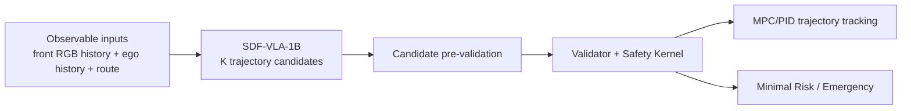

# SDF-VLA-1B 最终设计与实施基线

> **决策状态**：`APPROVED_DESIGN / PLANNED`
> **文档范围**：只定义 VLA，不定义其他学习模型
> **适用阶段**：G3、G6，并作为 G8 VLA 模型卡与发布验收的输入
> **固定硬件**：RTX 4080 Desktop 16GB + i5-13600KF，CARLA Windows，研发运行时 WSL2
> **结论日期**：2026-07-13
> 本文给出的是在本项目硬件、时间、磁盘和未来小车迁移约束下的最优工程方案，不宣称全行业绝对 SOTA。所有性能、时延、显存和训练时间在实测前都是预算或门槛，不是项目已取得的结果。

## 1. 最终结论

SafeDrive Foundry 的正式轻量驾驶 VLA 定名为 **SDF-VLA-1B**。

它不是从零训练的新基础模型，而是一个有明确上游、有项目原创结构、有本地数据适配、有闭环证据的派生驾驶模型：

```text
SDF-VLA-1B
= SimLingo / InternVL2-1B 派生权重
+ SafeDrive Observable Ego/History Adapter
+ SafeDrive FAST/REASON/DEFER Adaptive Router
+ SafeDrive Anchored Multi-Candidate Trajectory Head
+ SafeDrive Grounding + Uncertainty/OOD Heads
+ SafeDrive CARLA 数据配方与闭环后训练
+ Validator / Safety / MPC-PID 稳定执行接口
```

基础模型最终选 **SimLingo 的 InternVL2-1B 路线**。这是因为它同时具备：

- 约 1B 的可控规模；
- 公开代码、权重和数据生成路径；
- CARLA 闭环驾驶实现，而不是只有 VQA 或开环轨迹；
- 已有语言—动作对齐；
- 并行输出 path/speed 的动作头；
- 可冻结主干，只训练小头或少量 LoRA；
- 与单前视相机、路线和车辆状态的未来小车输入较接近。

这项选择必须先通过第 10 节的 `F0` 可行性门。未通过真实加载、显存、时延和稳定性测试前，只能称为“已选定的实施方案”，不能称为“已验证可运行模型”。

## 2. 模型名称、归属与可信表述

正式英文表述：

> **SDF-VLA-1B is a SafeDrive Foundry driving VLA derived from SimLingo and InternVL2-1B, featuring observable ego-history conditioning, adaptive language reasoning, anchored multi-candidate trajectory decoding, calibrated uncertainty, and project-specific closed-loop adaptation.**

正式中文表述：

> **SDF-VLA-1B 是基于 SimLingo/InternVL2-1B 派生的轻量驾驶 VLA；SafeDrive Foundry 新增了可观测车辆历史融合、自适应语言推理、锚定式多候选轨迹解码、不确定度估计，以及项目闭环数据适配。**

不能写：

- “完全自主研发的 1B 基础模型”；
- “从零训练的 VLA”；
- “自主研发 SimLingo”；
- 没有本项目实测就引用上游成绩作为 SDF-VLA-1B 成绩。

只有以下差异有代码、配置、训练谱系和消融证据后，`SDF-VLA-1B` 才不仅是改名：

1. SafeDrive Ego/History Adapter；
2. `FAST / REASON / DEFER` 三态路由器；
3. 以原始驾驶轨迹为锚点的多候选连续轨迹头；
4. 行为、关键 Actor、风险时域和路线意图的 grounding 辅助头；
5. 候选概率、数据不确定度、OOD 与选择性驾驶；
6. 项目 CARLA 数据、24 小时内适配配方、闭环消融和模型卡。

代码与模型发布必须保留 SimLingo、InternVL2 及传递依赖的署名、许可证和 NOTICE。SimLingo 代码仓库当前标注 Apache-2.0，但代码许可证不自动代表所有上游权重和数据都可无条件再发布；下载前和发布前分别审计代码、权重与数据许可。

## 3. 为什么这是当前最优路线

### 3.1 候选方案比较

| 候选路线 | 优点 | 对本项目的主要问题 | 决策 |
|---|---|---|---|
| **SimLingo / InternVL2-1B** | 1B；代码、权重、CARLA 数据和闭环链较完整；已有并行驾驶动作头 | 原仓库环境与本项目版本不同，需要只移植模型并重做 adapter | **正式基础** |
| BLUE + SimLingo | 约 0.11M gate 按帧决定是否使用语言；改动小、可解释、公开代码和日志 | 原始二态 gate 没有显式 abstain、输入失效和 deadline 状态 | **吸收思想，扩展为三态路由** |
| OpenDriveVLA / 通用 0.5B VLM | 参数较小 | 主要不是本项目的 CARLA 闭环实现，迁移和补齐风险更高 | 非首选 |
| LinkVLA | 强调语言与动作双向对齐 | 复现成熟度不足；离散动作 codebook 不符合本项目连续轨迹接口 | 只吸收辅助目标 |
| TakeVLA | 接管前监督和困难样本思路适合后训练 | 不适合作为 G3 的稳定基础权重 | G6 方法参考 |
| 3B～7B 驾驶 VLA | 可能有更高能力上限 | 推理显存、训练成本、闭环时延和数据需求超出当前单机边界 | 排除 |
| 从通用 VLM 从零改驾驶 | 自定义程度最高 | 需要重新获得驾驶能力，24 小时适配目标不可信 | 排除 |

### 3.2 决策标准

本项目按以下顺序选择基础模型：

1. 能否在 16GB 显存和 CARLA 共卡条件下稳定推理；
2. 是否已有 CARLA 闭环驾驶能力；
3. 是否有公开权重、代码和可审计许可证；
4. 是否能通过新增小头或 LoRA 在本地 24 小时内形成项目版本；
5. 是否输出连续轨迹供 Validator、Safety 和 MPC/PID 处理；
6. 是否支持带 Classic 和不带 Classic 的两种模式；
7. 输入是否能约束到未来小车可提供的传感器；
8. 是否能做公平消融，而不是一个不可拆分的黑盒。

按这些约束，SimLingo 不一定是参数更大或论文分数最高的模型，但它是当前实现成功率最高、路径最短、工程风险最低的基础。

## 4. VLA 在车辆系统中的职责

SDF-VLA-1B 负责根据视觉、车辆历史和路线生成未来 3～5 秒的多条连续候选轨迹，以及每条候选的概率和不确定度。

它不直接获得未经约束的方向盘、油门和刹车控制权。正式链路是：



这里不是削弱 VLA。VLA 仍然负责完整的行为与运动决策：继续、减速、停车、跟车、转弯、换道或绕行最终都体现为它提出的轨迹。Safety 只判断轨迹能否执行或是否必须降级，MPC/PID 只负责低层跟踪。

### 4.1 `HYBRID` 模式

```text
Classic candidates + SDF-VLA candidates
→ CandidateSet
→ Validator / Safety
→ MPC/PID
```

Classic 和 SDF-VLA 都可提出候选，但都不能绕过 Safety。该模式用于工业化研发、对照、Shadow、基线和稳健回退。

### 4.2 `VLA_ONLY` 模式

```text
SDF-VLA candidates only
→ CandidateSet
→ Validator / Safety
→ MPC/PID
```

运行时不得注入 Classic 候选，也不得在 SDF-VLA 失败时偷偷切回 Classic。若候选全部非法、过期或被拒绝，则进入 Minimal Risk/Emergency。

Classic 仍可在离线阶段提供专家标签和评测对照，但不参与 `VLA_ONLY` 当前帧决策。该模式用于证明 SDF-VLA-1B 能完整承担驾驶决策，而不是只做辅助建议。

## 5. SDF-VLA-1B 结构

### 5.1 可观测输入

第一版固定使用：

- 单前视 RGB 短历史，4 帧起步，可配置到 8 帧；
- Ego 速度、加速度、yaw rate、历史位姿增量和历史控制；
- 稀疏 Route/navigation command 与局部路线点；
- 时间戳、frame identity、freshness 和传感器有效标记；
- 可选结构化驾驶指令。

CARLA 隐藏未来、真实 TTC、隐藏意图、完整 Actor 真值只能用于标签或评价，必须标记为 `oracle/evaluation_only`，不能进入策略前向。

未来搬到小车时，前向输入仍限制为前视相机、里程计/车辆状态和导航路线。这样换传感器 adapter 即可，不需要重新定义模型权限。

### 5.2 上游驾驶锚点

保留 SimLingo/InternVL2-1B 的视觉—语言主干，以及原始 path/speed action queries。原始输出定义为锚点候选 `tau_0`：

- 先验证公开 checkpoint 的基础行为；
- 新增结构未训练好时保持确定初始化；
- 关闭项目模块后可复现上游输出；
- 用消融证明项目修改有无净收益；
- 防止新多候选头一开始就偏离可驾驶分布。

不复制 SimLingo 自带 CARLA client、Leaderboard、Scenario Runner 或 tick master。只移植模型、必要预处理和权重加载逻辑，通过项目现有 `sdf sim`、ObservationBundle 和 Runtime adapter 接入 CARLA 0.9.16。

### 5.3 Observable Ego/History Adapter

该模块把车辆状态历史和路线编码为少量状态 token，再与视觉 token 轻量融合。

第一版建议：

```text
ego/route numeric features
→ normalization
→ 2-layer MLP
→ temporal pooling
→ gated cross-attention
→ fused driving tokens
```

它解决单帧图像难以判断速度变化、控制滞后和短时运动趋势的问题。参数量要小，避免为加入车辆状态重新训练完整视觉主干。

必须保留四组对照：

- 无 Ego state/history；
- 只有当前 Ego state；
- 当前状态 + 4 帧历史；
- Route/Ego-only 非视觉基线。

### 5.4 FAST/REASON/DEFER Adaptive Router

本项目借鉴 BLUE “只在需要时使用语言”的核心观察，但不原样照搬二态 gate，而是实现三态路由：

| 状态 | 模型行为 | 典型情况 |
|---|---|---|
| `FAST` | 不自回归生成解释，直接由 action queries 并行输出轨迹 | 常见直行、稳定跟车、场景熟悉、候选一致 |
| `REASON` | 生成受限长度的结构化语义表示，再条件化轨迹头 | 路线冲突、复杂交互、关键 Actor、候选分歧、轻度 OOD |
| `DEFER` | 输出 abstain/degraded，不伪造高置信轨迹 | 严重 OOD、图像无效、状态过期、deadline 不足或模型不可用 |

Router 输入包括：

- 冻结 VLA hidden state；
- Ego 动态与路线特征；
- 图像/状态 freshness；
- 候选分歧和 top-1 margin；
- OOD 分数；
- 当前剩余推理 deadline。

Router 第一版控制在约 0.1M～1M 可训练参数。先冻结主干单独训练和校准，再决定是否与 LoRA 联合微调。

`REASON` 只能产生有限 schema 的行为、关键 Actor、风险原因、路线意图和短解释。自由文本不进入 Safety 硬判断，也不能直接转换为控制命令。

### 5.5 Anchored Multi-Candidate Trajectory Head

SDF-VLA-1B 不把驾驶动作离散化成自由生成的文本 token，也不让新头完全覆盖上游轨迹。第一版使用锚定残差：

```text
tau_0 = original SimLingo path/speed trajectory
tau_k = project_to_bounds(tau_0 + delta_tau_k), k = 1 ... K-1
```

实现规则：

- `K=4` 起步，只有资源和覆盖收益通过后才增加到 6 或 8；
- horizon 在 3～5 秒内配置，并显式携带时间；
- `delta_tau_k` 有横向、纵向、速度、加速度、曲率和 jerk 边界；
- 一次前向并行产生全部候选，禁止为每条候选重复运行视觉主干；
- 每条候选携带 probability、uncertainty、source、timestamp 和 model/config hash；
- 坐标系、单位、采样间隔和 frame identity 必须版本化；
- CandidateSet 必须被 G2 Validator 无损解析。

多候选不能只是同一路径加微小噪声。训练应使用集合匹配或 best-of-K 主损失，并监控：

- mode coverage；
- candidate diversity；
- candidate collapse；
- executable rate；
- Safety rejection rate；
- 最佳候选是否长期不是 top-1。

### 5.6 Grounding 辅助头

除了轨迹，模型训练时并行预测：

- 行为类别：保持、减速、停车、跟车、转弯、变道、绕行；
- 关键 Actor identity 或可观测区域；
- 风险发生时域；
- 路线意图；
- 候选为什么不同的结构化原因。

这些目标用于让视觉、语言和动作对齐，但正式控制只消费连续轨迹和结构化置信信息。即使语言解释错误，Safety 也不能把它当作安全事实。

### 5.7 不确定度、OOD 与选择性驾驶

第一版采用单模型可承担的低成本组合：

- 候选分布熵；
- top-1 probability margin；
- 每候选 aleatoric waypoint variance；
- hidden-state energy/OOD head；
- Router confidence；
- 输入缺失、模糊、曝光、延迟和路线冲突检测；
- 离线 MC dropout 或 checkpoint disagreement，仅用于校准审计。

输出必须区分“预测低风险”和“模型不知道”。严重 OOD 或不确定度超门槛时进入 `DEFER`，不能通过提高概率或修改 Safety 阈值强行继续。

## 6. 数据方案

### 6.1 数据来源

第一轮数据由三部分组成：

1. 上游 checkpoint 和少量公开样本：只用于预处理、权重和输出一致性检查；
2. 本项目 CARLA Observable 采集：用于相机、车辆状态、路线与连续轨迹适配；
3. 项目闭环困难样本：用于接管前、接管、恢复、分歧、OOD 和失败后训练。

第一轮不默认下载完整 SimLingo 数据集，也不把上游全部数据复制到本地。只按 manifest 拉取必要权重和少量验证样本，主要训练数据由项目自己的 CARLA 流程生成。

### 6.2 样本结构

每个训练样本至少包含：

```text
run_id / scenario_id / frame_id
timestamps and sensor freshness
front RGB history references
observable ego/history
route/navigation
expert or executed trajectory
alternative bounded trajectories
behavior / critical actor / risk-horizon labels
oracle permission mask
split / provenance / license / hash
```

原始图像只保存一次。轨迹、标签、事件和增强信息通过 frame ID 引用，不能为每个任务复制一份图像。

### 6.3 划分与泄漏

- 按 scenario family、parameter hash、Town、天气和路线分组；
- 相邻帧和同一事件窗口不能跨 split；
- Regression 永不进入训练或调参；
- Oracle 只生成标签，不进入前向；
- 同一基础片段的增强版本必须在同一 split；
- train/validation/test manifest 一旦冻结，只能新增版本，不能原地挪样本。

### 6.4 第一轮规模

启动目标是约 20k～50k 个去重关键训练样本，而不是连续录像每一帧都训练。优先覆盖：

- 常见直行、跟车、转向和停车；
- 路口、行人、切入、遮挡和路线冲突；
- 视觉模糊、曝光、帧丢失和状态延迟；
- 专家与模型分歧；
- 接管前和恢复窗口；
- 正常样本与困难样本的冻结配比。

实际样本数由 G3-03 测得的 step time 和 24 小时上限反推，不能先收集无限数据再发现训不完。

## 7. 本地训练与微调方案

### 7.1 总原则

- 不从零训练视觉—语言主干；
- 不把全参数微调、PPO 或多卡 RL 设为必需项；
- 先冻结上游，只训练项目新增模块；
- 新增模块稳定后才允许末层 LoRA；
- 每轮本地适配计划不超过 24 小时；
- 训练时关闭 CARLA，闭环时不加载优化器；
- 一次只训练一个 adapter/checkpoint；
- 每个阶段都能保存、恢复和回滚。

### 7.2 训练阶段

| 阶段 | 训练内容 | 主干状态 | 计划时间预算 | 必做 |
|---|---|---|---:|---|
| `A0` | 20～100 step resource smoke、小样本过拟合、保存恢复 | 全冻结 | 0.5～1.5h | 是 |
| `A1` | Ego/History Adapter、Router、多候选头、Grounding/uncertainty heads | 全冻结 | 3～8h | 是 |
| `A2` | 最后 4～8 个语言层 LoRA，rank 8 起步、必要时 16 | 视觉冻结，语言层部分 LoRA | 6～14h | 条件必做 |
| `A3` | 温度缩放、OOD 和 abstention 阈值校准 | 不更新主干 | 1～3h | 是 |
| `A4` | 接管前/困难样本 adapter 或 preference SFT | 一次一个 adapter | 单轮 ≤24h | G6 |

这些时间是准入预算，不是速度承诺。必须用真实 step time 计算：

```text
predicted_train_time
= step_time_P95 * planned_steps
+ validation_time
+ checkpoint_time
+ calibration_time
```

若预测超过 24 小时，依次减少：

1. 数据重复轮次；
2. LoRA 层数；
3. 历史帧；
4. 输入分辨率；
5. 候选 K；
6. 正式训练步数。

不能为了满足时间口径跳过验证，也不能静默把云端训练变成必要条件。

### 7.3 损失函数

```text
L = w_anchor * L_anchor
  + w_set * L_best_of_K_or_matching
  + w_prob * L_candidate_probability
  + w_dyn * L_kinematic_smoothness
  + w_ground * L_behavior_actor_risk_grounding
  + w_router * L_fast_reason_defer
  + w_unc * L_uncertainty_calibration
```

- `L_anchor` 防止项目头破坏原始驾驶能力；
- `L_set` 学习多模态覆盖；
- `L_prob` 让 top-1 排序与候选质量一致；
- `L_dyn` 约束平滑和运动学可执行性，但不代替 Safety；
- `L_ground` 对齐行为、关键 Actor、风险时域与轨迹；
- `L_router` 使用实际语言收益、错误、OOD 和推理预算作为标签；
- `L_unc` 用于选择性驾驶和置信校准。

所有权重必须配置化并进入 checkpoint manifest。禁止把多个目标写死到一个不可消融的总分中。

### 7.4 LoRA 和量化

优先顺序：

1. BF16/FP16 冻结主干 + 新增小头；
2. BF16/FP16 LoRA；
3. 8-bit base + LoRA；
4. 只有上述方案显存不通过时才尝试 4-bit QLoRA。

训练采用 gradient checkpointing、micro-batch 1、梯度累积和有限 DataLoader workers。在线部署分别验证 BF16、8-bit 和 4-bit，不能只因更省显存就默认最低精度。

## 8. 推理与单机预算

初始准入目标：

| 模块 | 目标频率 | 原则 |
|---|---:|---|
| Safety 与 MPC/PID | 50Hz | 不等待 GPU |
| SDF-VLA `FAST` | 目标 10Hz | queue depth 1，过期输入直接丢弃 |
| SDF-VLA `REASON` | 事件触发，目标 1～2Hz | 不阻塞 FAST 或控制 |
| 数据记录 | 异步 | 不反压实时控制 |

VLA 在线显存初始目标约 5～6GB，整卡稳定峰值仍以项目统一的约 14～14.5GB admission target 为准，并保留至少约 2GB 波动空间。以上必须实测。

资源不足时按固定顺序降级：

1. 关闭在线 `REASON`，保留 `FAST`；
2. 从 K=4 降到 K=3 或 K=2；
3. 从 8 帧降到 4 帧；
4. 降低输入分辨率；
5. 从 BF16 切到经验证的 8-bit；
6. 若候选过期或不可用，按运行模式进入 Classic 回退或 Minimal Risk。

`VLA_ONLY` 不允许执行第 6 步中的 Classic 回退。

每次资源报告至少记录：

```text
model revision and precision
image resolution / history length / K
Windows CARLA VRAM
WSL CUDA allocated/reserved
whole-GPU peak
latency P50/P95/P99
deadline miss
CPU and RAM peak
OOM / thermal / disconnect / recovery
```

## 9. VLA 磁盘预算

本文只计算 VLA 活跃工作集：

| 类别 | 计划上限 |
|---|---:|
| 上游权重、依赖缓存和许可证快照 | 15～20GB |
| G3 去重图像、状态和标签 | 35～50GB |
| G6 困难样本与接管窗口 | 15～25GB |
| current、best、rollback checkpoints | 15～25GB |
| Regression、Evidence、报告和代表性视频 | 10～15GB |
| 临时 shard、训练缓存与余量 | 15～25GB |
| **VLA 计划总量** | **105～160GB** |

VLA 本身不应占满 200GB。达到冻结配额时停止采集并报告，不自动删除 Regression、Evidence 或冻结 split。中间 checkpoint 采用滚动保留，但删除前必须确认不是 best、rollback 或审计依赖。

## 10. 强制可行性与验收门

### `F0`：基础 checkpoint 可行性

必须依次通过：

1. 冻结上游代码、权重、预处理、许可证和 hash；
2. 在独立最小环境加载 checkpoint；
3. 对固定样本复现确定性 path/speed 输出；
4. 完成 BF16/8-bit 前向；
5. 测量整卡显存、P50/P95/P99、deadline miss 和 30 分钟稳定性；
6. 完成 20～100 step resource smoke、保存和恢复；
7. 通过 ObservationBundle → CandidateSet → Validator 解析链；
8. 确认没有引入第二套 CARLA client 或 tick master。

关键项失败则停止正式训练，记录错误和最小修复。不得自动换大模型继续试错。

### `F1`：结构正确性

- 关闭项目模块时，`tau_0` 与上游输出一致；
- K 个候选的 shape、时间、坐标、概率和 hash 完整；
- 非法、NaN、过期和不连续轨迹被拒绝；
- Router 三态和语言关闭开关可复现；
- 小样本能够过拟合；
- candidate collapse 能被测试检测；
- `VLA_ONLY` 没有 Classic 候选泄漏。

### `F2`：离线能力与资源

- 与 Route/Ego、视觉单轨迹、非语言多候选固定预算比较；
- 报告 ADE/FDE/NLL、覆盖、多样性、可执行率和 Safety 拒绝；
- 报告行为/Actor grounding、ECE/Brier、OOD、误 defer 和漏 defer；
- 比较 BF16、8-bit、4-bit 的精度—时延—显存；
- 单轮训练在 24 小时预算内，或如实判定当前配置不可行；
- VLA 活跃工作集不超过冻结配额。

### `F3`：闭环能力

- 对比 Classic、非语言多候选、上游 anchor、Raw SDF-VLA、SDF-VLA+Validator、SDF-VLA+Safety；
- `HYBRID` 和 `VLA_ONLY` 分开报告；
- 报告碰撞、路线完成、违规、无故停车、舒适、接管、MRM 和资源；
- 覆盖视觉退化、stale、OOM、路线冲突、传感器缺失和 OOD；
- 模型失效不能阻塞 50Hz Safety/MPC/PID；
- 没有稳定净收益时保留负结论，不能移动 split 或阈值。

证据状态统一遵循：

```text
PLANNED → IMPLEMENTED → MEASURED → VERIFIED
```

未达到 `VERIFIED` 的数字不得作为项目成绩或简历量化表述。

## 11. 必做消融

| 消融 | 目的 |
|---|---|
| SimLingo anchor vs SDF-VLA-1B | 证明项目修改的净价值 |
| 单轨迹 vs K=4 多候选 | 隔离多候选本身的收益 |
| 无语言 vs 每帧语言 vs adaptive router | 证明语言何时有用及路由是否节省时延 |
| 二态 FAST/REASON vs 三态 FAST/REASON/DEFER | 证明 abstention 的安全和校准价值 |
| 无 Ego history vs current state vs short history | 证明车辆历史融合价值 |
| 独立候选头 vs anchored residual head | 证明锚定对稳定性和回归的影响 |
| 无 grounding heads vs 完整 grounding | 检查语义辅助目标是否真正改善动作 |
| 无 uncertainty vs calibrated uncertainty | 证明选择性驾驶不是固定阈值技巧 |
| frozen heads-only vs LoRA rank 8 vs rank 16 | 找到能力、时长和显存的最佳点 |
| BF16 vs 8-bit vs 4-bit | 决定正式部署精度 |
| `HYBRID` vs `VLA_ONLY` | 分离稳健工程模式和纯 VLA 驾驶能力 |
| base vs 随机采样后训练 vs 困难样本后训练 | 证明 G6 数据效率 |

## 12. G3 与 G6 的实施映射

### G3：形成可独立闭环的 SDF-VLA-1B

| 任务 | 本文对应交付 |
|---|---|
| G3-01 | 冻结 Observable 输入、Oracle 标签、identity、许可和 split；建立 VLA sample manifest |
| G3-02 | Route/Ego、视觉单轨迹、非语言多候选基线 |
| G3-03 | 执行 `F0`；实现上游 adapter、Ego/History Adapter、三态 Router 和锚定多候选头 |
| G3-04 | 执行 A0～A3；训练 grounding、校准、OOD 和 selective driving |
| G3-05 | 分别验收 `HYBRID` 与 `VLA_ONLY` 闭环，冻结 `sdf-vla-1b-g3` |

G3 完成时，SDF-VLA-1B 必须能独立提出完整驾驶轨迹，而不是只给 Classic 调权或提供语言解释。

### G6：形成项目特调版本

| 任务 | 本文对应交付 |
|---|---|
| G6-01 | 把接管、分歧、OOD、超时切成可审计训练窗口 |
| G6-02 | Shadow DAgger 和 takeover/pre-takeover 专家查询，区分 proposed/executed/counterfactual action |
| G6-03 | LoRA/adapter SFT 与经 CARLA/专家验证的 preference/risk post-training |
| G6-04 | base、G3、G6 checkpoint 的抗遗忘和资源回归 |
| G6-05 | 验收发现失败→数据门禁→后训练→回归的完整飞轮 |

G6 是“自己的特调模型”最强证据：它使用项目闭环失败、接管前和恢复数据进行针对性适配，并有严格前后对照。

## 13. 主要风险与后备路线

### 13.1 主要风险

1. **环境版本**：上游使用 CARLA 0.9.15，本项目是 0.9.16。只移植模型和预处理，不移植仿真入口。
2. **显存**：Windows CARLA 与 WSL 模型共享 16GB。先单视角、K=4、短历史、8-bit 验证，不复制视觉主干。
3. **语言负收益**：语言可能只在少数帧有效。Router 必须允许 FAST，并用闭环收益决定是否触发。
4. **候选坍塌**：使用锚定残差、集合损失、diversity floor 和覆盖指标。
5. **过度自信**：必须报告 OOD、误 defer、漏 defer 和校准，不只报告平均轨迹误差。
6. **仿真到小车迁移**：策略只读 Observable，坐标、单位、时间和传感器缺失都版本化。
7. **训练超时**：先测 step time 再冻结样本量和步数，不靠盲目增加 epoch。

### 13.2 唯一后备顺序

主方案失败时不立即换 3B/7B 模型：

1. 保持 SDF-VLA-1B 架构，减少图像 tile、历史帧、K 和 LoRA 层；
2. 比较 BF16、8-bit 和 4-bit，必要时关闭在线 REASON；
3. 若 SimLingo 派生 checkpoint 本身不兼容，则使用官方 InternVL2-1B 权重加载同一 SafeDrive adapter/router/action-head 结构；
4. 该后备版本标记为 `SDF-VLA-1B-IVL`，重新执行 `F0～F3`，不能继承 SimLingo 闭环成绩；
5. 只有以上路线都被真实证据否决，才重新进行基础模型选型。

后备路线仍必须是 VLA。纯 Classic 和纯非语言模型只能作为基线，不能冒充最终学习方案。

## 14. 版本命名

| 版本 | 含义 |
|---|---|
| `sdf-vla-1b-anchor@0.0.x` | 上游权重 + 项目输入/输出 adapter，只用于复现 |
| `sdf-vla-1b-g3@0.1.x` | Router + anchored K-candidate + grounding + uncertainty，完成闭环验收 |
| `sdf-vla-1b-flywheel@0.2.x` | 加入 G6 hard-case/DAgger/preference adapter，并通过抗遗忘回归 |

每个版本必须保存：

- base model revision；
- 代码 commit；
- data manifest 与 split hash；
- config hash；
- precision/quantization；
- 训练硬件、时长和峰值资源；
- 上游许可证清单；
- 适用运行模式；
- 已知失败切片；
- best 与 rollback checkpoint。

## 15. 建议代码边界

```text
safedrive_foundry/driving_vla/
├── schema/          Observation、CandidateSet、label 与 manifest schema
├── data/            dataset、CARLA adapter、split 与 leakage audit
├── baselines/       Route/Ego、视觉单轨迹、非语言多候选
├── model/
│   ├── backbone/    上游权重加载与冻结策略
│   ├── ego_adapter/ Ego/History/Route token
│   ├── router/      FAST/REASON/DEFER
│   ├── trajectory/  anchored multi-candidate head
│   ├── grounding/   behavior/actor/risk/intent heads
│   └── uncertainty/ probability/calibration/OOD
├── training/        LoRA、loss、checkpoint、resume 与资源监控
├── evaluation/      open-loop、closed-loop、slice 与 ablation
├── runtime/         queue、deadline、cache 与 degradation
├── adapter/         Runtime/ROS/Safety/MPC 稳定边界
└── posttrain/       G6 DAgger/preference adapter
```

schema 只能有一个版本化来源。训练、runtime 和 post-training 不得各自复制一套坐标系、候选结构或权限字段。

## 16. 研究来源与采用边界

以下来源用于选型和结构设计。论文或上游仓库数字只代表上游结果，不是 SafeDrive Foundry 实测：

- [SimLingo paper (CVPR 2025)](https://arxiv.org/abs/2503.09594)：InternVL2-1B、并行 path/speed action queries、语言—动作对齐。
- [SimLingo official code](https://github.com/RenzKa/simlingo)：公开模型、训练、数据生成和 CARLA 闭环评价路径；仓库标注 Apache-2.0。
- [SimLingo model](https://huggingface.co/RenzKa/simlingo) 与 [dataset](https://huggingface.co/datasets/RenzKa/simlingo)：按需获取权重与少量验证样本，不默认拉取完整数据。
- [BLUE paper](https://arxiv.org/abs/2606.08684) 与 [official code](https://github.com/George-Ling3/BLUE)：轻量 gate 按需启用语言；项目扩展为 FAST/REASON/DEFER 三态。
- [LinkVLA](https://arxiv.org/abs/2603.01441)：语言—动作双向对齐和动作理解辅助目标；项目保留连续轨迹，不采用离散动作 codebook 作为主路线。
- [TakeVLA](https://arxiv.org/abs/2603.14972)：takeover/pre-takeover 监督和困难样本思路；仅用于 G6 后训练设计。

## 17. 最终决策句

在公开可获得性、CARLA 闭环基础、RTX 4080 16GB、24 小时本地适配、VLA 活跃工作集不超过约 160GB，以及未来小车迁移等约束下，**SimLingo/InternVL2-1B 派生的 SDF-VLA-1B 是当前最优且最可落地的 VLA 路线**。

项目从此不在 G3 开始前反复更换基础模型。先执行 `F0`，再完成 G3 结构与闭环，最后通过 G6 困难样本后训练形成正式特调版本。只有真实门禁证据否决主方案时，才启用第 13.2 节后备路线或重新选型。
