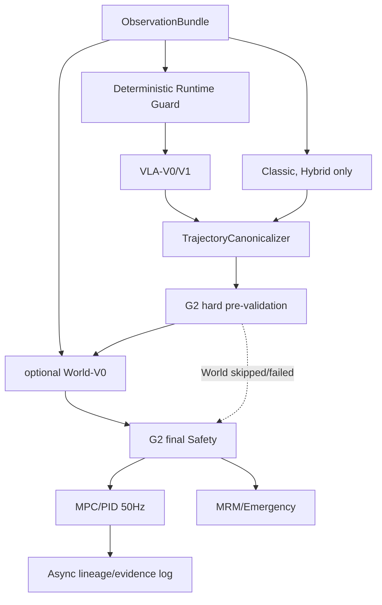

# SafeDrive Foundry VLA 主线与可选 World 总体架构

> **决策状态**：`APPROVED_DESIGN / PLANNED`
> **范围**：一个人、RTX 4080 16GB、本地完成；G2 已完成且保持冻结
> **结论日期**：2026-07-14

本文是集成蓝图。VLA 细节见 `SDF_VLA_1B_DESIGN.md`，World 门禁与 World-V0 见 `SDF_WORLD_MODEL_DESIGN.md`，Safety 权限仍以既有 G2 合同为准。

## 1. 固定架构

```text
VLA 提出完整轨迹
→ optional World Model 评价和排序
→ G2 Validator / Safety Kernel 最终裁决
→ MPC/PID 执行
```

Classic 只在 Hybrid 中作为并列候选提出者。VLA/Classic 都不能绕过 Safety；World 只有软排序权；Safety、MRM、Emergency 和 MPC/PID 权限不变。

## 2. 组件关系

| 组件 | 职责 | 权限边界 |
|---|---|---|
| Classic | Hybrid 候选、离线专家/修正标签和基线 | 无 Safety 特权 |
| SDF-VLA-1B | 从视觉/ego/route 产生完整轨迹 | 不直接发底盘控制 |
| World-V0 | 通过门禁后评价 K=2 候选 | 只软排序，可完全关闭 |
| G2 Validator/Safety | 硬预检、最终裁决、修复、回退、MRM/Emergency | 最高在线安全权限 |
| MPC/PID | 50Hz 跟踪批准轨迹 | 不重做行为决策 |

## 3. 两个必须保留的运行模式

### 3.1 `VLA_SAFETY`

```text
VLA-V0/V1 candidates only
→ canonicalizer
→ G2 hard pre-validation
→ optional World-V0 soft ranking（通过门禁时）
→ final Safety
→ MPC/PID
```

- 当前帧禁止注入 Classic 候选；
- World 未实施、关闭或异常时就是 `VLA + Safety`；
- VLA timeout/DEFER/无合法轨迹时只允许 Safety 保留轨迹、MRM 或 Emergency，不得暗切 Classic；
- Classic 仍可离线生成训练修正轨迹和评测对照。

### 3.2 `HYBRID`

```text
Classic candidates ∪ VLA candidates
→ source-aware dedup/canonicalization
→ G2 hard pre-validation
→ optional World-V0 soft ranking（通过门禁时）
→ final Safety
→ MPC/PID
```

- Classic 和 VLA 同合同、同预检、同 Safety；
- World 不得根据 source 暗改风险阈值；
- World 失效不影响 Classic/VLA 候选进入 Safety；
- VLA 失效时允许按 Hybrid 合同继续 Classic+Safety。

`HYBRID` 是工程稳健模式，单独报告，不混入 VLA/World 的主要因果比较。

## 4. 递进模型合同

| 版本 | K/T/horizon | 输入 | 必须完成 |
|---|---|---|---|
| VLA-V0 | 1/10/2.5s | 上游所需当前 Observation | 是 |
| VLA-V1 | 2/10/2.5s | 当前图像 + 当前 ego + 4 时刻低维 history | 是 |
| VLA-V2 | 沿用 V1 | Guard 后 FAST/REASON | Router optional enhancement |
| World-V0 | 2/10/2.5s，N≤8，M=1 | ego/actors/road + K2 | 仅 WE0 通过后必须 |

3 秒、T12、K4、N16、M3 都是后续升级，不得静默改变首版 schema。

## 5. 在线数据流



VLA-V0 的 SimLingo path/speed 只 canonicalize 为 `K1/T10/dt0.25s`，不外推成 3 秒预测。VLA-V1 增加 conservative 候选；World 只能处理经过硬预检的候选。

## 6. 实施主线和条件分支

```text
G0 → G1 → G2（已完成/冻结）
             ↓
G3：VLA-V0 → VLA-V1 → VLA+Safety 闭环
             ↓
G4A：固定场景/replay/可比 K2/oracle best-of-K
             ├─ 无选择空间 → 记录负结论，仍接入 World 作作品模块（C2 不宣称正收益）
             └─ 有选择空间 → G5 World-V0 → 闭环 A/B
             ↓
G6：一轮困难样本监督适配
             ↓
G8：统一回归、Evidence、发布

G4B 与 G7：Optional / After Release
```

World 不再是阶段完成的无条件依赖。G6 只依赖 G3、G4A 和可用的 G5 结论；若 World 被门禁跳过，G6 直接针对 VLA 失败进行。

## 7. World 入口门禁

在 20～40 个冻结困难场景比较 VLA top-1 与 oracle best-of-K。仅当：

1. K2 经常存在明显更优候选；
2. oracle best-of-K 稳定优于 top-1；
3. 候选不经常同步失败；
4. initial-state hash/seed/交互可比；

才进入 World-V0。否则分别记录 `NO_SELECTION_SPACE` 或 `IMPROVE_VLA`，不为 World 强行扩 K/模型/搜索。

## 8. 一轮 G6 数据闭环

```text
VLA 闭环失败
→ 保存失败前 2～4 秒窗口
→ Classic/Safety/人工规则生成修正轨迹
→ 训练一个 adapter 或少量 LoRA checkpoint
→ 同一冻结困难集做 before/after
→ 正常集抗遗忘 + Safety 接管率 + 时延回归
```

第一轮不做 PPO、GRPO、RL、多种 preference optimization、多轮自动飞轮，也不同时训练 VLA 和 World。日志必须区分 `proposed / accepted / executed / corrective` action。

G6验收必须同时报告：至少一个预登记困难切片改善；正常场景无明显退化；Safety接管率不增加；推理时延无明显恶化；失败记录、样本、训练配置、checkpoint和评测结果可全链追溯。任一护栏失败都保留negative result，不通过移动阈值换结论。

## 9. 双许可谱系

| Lineage | 基础资产 | 数据 | deployment scope |
|---|---|---|---|
| SimLingo research | SimLingo checkpoint | 许可允许的研究样本 + 项目 CARLA | `simulation_research_only` |
| Clean deployable | 许可清晰的 InternVL2-1B/其他基础权重 | 项目自采 CARLA + 未来自有数据 | 重新验收后确定 |

Clean lineage 必须重新训练 adapter、trajectory head、router，并重新执行 VLA、可选 World、Safety 和实车门禁。每个 checkpoint manifest 必须记录 base revision、code/data hash、license/deployment scope、precision、config、runtime mode 和 limitations。

## 10. 多频率与资源

| 环 | 首版 admission target |
|---|---:|
| Safety + MPC/PID | 50Hz，不等待 GPU |
| VLA-V0/V1 | P95≤200ms，约5Hz；10Hz 后续优化 |
| World-V0 | 目标约5Hz，K2 batch |
| VLA-V2 REASON | 事件触发，不阻塞 FAST |
| Logger | 异步有界队列 |

在线整卡仍以约 14～14.5GB 稳定峰值为 admission target。资源不足时：关闭 REASON → 跳过 World → V1回退V0 → 降分辨率/经验证量化 → 按运行模式进入 Classic 或 MRM。不能降低 Safety 频率。

常态活跃磁盘目标：

| 资产池 | 计划范围 |
|---|---:|
| 共享 Observation/split/Evidence | 25～35GB |
| VLA 独占 | 55～90GB |
| World-V0 独占（仅门禁通过后） | 25～45GB |
| **无 World / 有 World** | **80～125GB / 105～170GB** |

200GB 是软上限而不是预占目标，400GB 只作导入/重打 shard/迁移缓冲。

## 11. 故障降级

| 故障 | VLA_SAFETY | HYBRID |
|---|---|---|
| World timeout/OOM/invalid | VLA+Safety | Classic/VLA+Safety |
| VLA timeout/Guard DEFER | MRM/Emergency | Classic+Safety |
| Classic unavailable | 不适用 | VLA+Safety，可选 World |
| 候选全拒绝 | MRM/Emergency | MRM/Emergency |
| Safety 修复失败 | MRM/Emergency | MRM/Emergency |

降级记录 trigger、frame、previous/new mode、候选数量、原因和恢复结果。

## 12. G8 主要比较

保留四个槽位，但允许 World negative result：

1. `Classic + Safety`；
2. `VLA + Safety`；
3. `VLA + World + Safety`；
4. `Post-trained VLA + World + Safety`。

若 World 选择空间弱或闭环无净收益，第3项仍须可运行并标 `negative / no_stable_gain`（可 Shadow 对照）；第4项无 posttrain 则 limits。同时正式报告：

- Classic + Safety；
- VLA + Safety；
- Post-trained VLA + Safety。

Hybrid 单独作为工程稳健模式报告，不纳入主要因果阶梯。

## 13. 最低项目成果

必须完成：

1. VLA-V0；
2. VLA-V1；
3. 无 Classic 当前帧候选的 VLA+Safety 闭环；
4. 固定场景和 oracle best-of-K；
5. 一轮困难样本监督后训练；
6. 完整 Evidence Bundle。

World 只在选择空间门禁通过后成为必做 World-V0。G4B 和 G7 Agentic Research Loop 不属于发布完成条件；普通脚本、CLI、Registry、自动报告和 Evidence Bundle 仍是必做确定性基础设施。

## 14. 实车迁移边界

CARLA checkpoint 不能直接上公共道路。未来小车必须替换传感器/时间同步/地图/底盘 adapter，重标定车辆动力学与 MPC/PID，采用 Clean deployable lineage，并从低速封闭场地、Shadow、遥控急停和逐级放权开始。Safety/MRM/Emergency 权限不得因迁移而降低。

## 15. 文档职责

| 文档 | 职责 |
|---|---|
| `G2_G8_INDUSTRIAL_ARCHITECTURE.md` | 工业硬合同和 Safety 权限 |
| `SDF_VLA_1B_DESIGN.md` | VLA-V0/V1/V2、训练和许可谱系 |
| `SDF_WORLD_MODEL_DESIGN.md` | WE0 入口门禁与 World-V0 |
| 本文 | 两种模式、条件主线、资源和 G8 配置 |
| `START_TASK.md` / `tasks` | 当前任务路由、范围和验收 |

最终主线是“必须完成 VLA，先用 oracle 证明 World 值得做，再决定是否进入轻量 World-V0”。这保留工业架构和研究亮点，同时把单人单卡项目的完成风险控制在可验证范围内。
