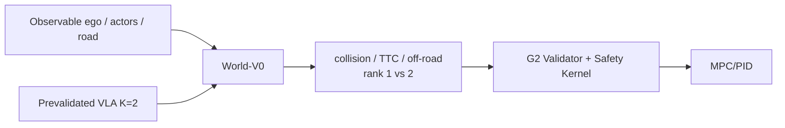

# World-V0 动作条件世界模型设计与入口门禁

> **决策状态**：`GATED_DESIGN / PLANNED`
> **适用阶段**：G4A、G5、G8
> **固定硬件**：一个人，RTX 4080 Desktop 16GB + i5-13600KF，本地完成
> **前置合同**：VLA-V1、G2 Validator/Safety、`SINGLE_MACHINE_EXECUTION_BUDGET.md`
> **结论日期**：2026-07-14
>
> World Model 是重要目标，但不是无条件主线。未通过第 3 节入口门禁时，不实现学习型 World；记录负结论并继续优化 VLA。参数、时延、显存和收益在实测前都只是预算。

## 1. 最终首版

第一版定名为 **World-V0**，不强制使用 `SDF-WorldGuard-12M` 名称：

```text
World-V0
= Observable ego + top-8 actors + simplified lane/drivable area
+ VLA-V1 K=2 timed trajectories
+ single-mode action-conditioned dynamics
+ collision / TTC / off-road heads
+ two-candidate soft ranker
+ deterministic anomaly flags
```

固定首版规模：

| 项目 | World-V0 |
|---|---:|
| 候选 K | 2 |
| 时间 T / dt / horizon | 10 / 0.25s / 2.5s |
| Actor N | ≤8 |
| future mode M | 1 |
| 参数量 | 约 4M～8M，实施后登记实数 |
| 视觉特征 | 不要求 `FrozenVisualFeatureRef` |
| 在线权限 | 仅软排序，不修改 Safety 硬阈值 |

RIA、WoTE、SparseWorld 等只提供研究结构参考。World-V0 在项目内独立实现，不复制后改名，也不继承论文成绩。

## 2. 系统职责



World-V0 只能在 G2 硬预检之后重新排列合法候选。它不能：

- 放行已被 Validator 拒绝的候选；
- 修改碰撞、道路、slack、回退或 Emergency 阈值；
- 直接发 steering/throttle/brake；
- 把 CARLA Oracle 字段放进 runtime 前向；
- 成为 tick owner 或在当前帧启动 CARLA 分支；
- 把异常、超时或 OOD 输出解释为零风险。

World timeout、OOM、NaN、输入过期或异常时跳过排序，确定性退化为 `VLA + Safety`。

## 3. 选择空间科学标注（与作品必做接入）

G4A 必须在冻结的 20～40 个困难场景上比较：

```text
VLA top-1
vs
oracle best-of-K（K=2，仅评价，不进入在线控制）
```

四项选择空间条件（用于 **C2 表述强度**，不是删除模块的开关）：

1. K=2 中经常存在结果明显更好的候选；
2. oracle best-of-K 在预先冻结困难切片中稳定优于 VLA top-1；
3. 两条候选不是经常同步失败；
4. 动作分支有相同 initial-state hash、seed 和可比交互状态。

阈值、统计单位、最小样本和“明显更好”的定义必须在看最终结果前冻结。

**本仓库作品路径：** 无论下列标签为何，G5 World-V0 **仍须实现并接入** `VLA+World+Safety` 演示配置；标签只决定能否宣称“World 有选择空间/净收益”。详见 `PROJECT_SUCCESS_PROFILE.md` 与 `START_TASK.md` §5.2。

科学标注结果：

| 结果 | 科学含义 | 本项目实现 |
|---|---|---|
| `ENTER_WORLD` | 四项同时通过，选择空间充分 | 实施 World-V0；C2 可冲正收益 |
| `WEAK_SELECTION_SPACE` | 部分满足/不稳定 | 仍实施 World-V0；C2 谨慎 |
| `IMPROVE_VLA` | 候选同步失败或坍塌 | 仍实施 World-V0；优先记 VLA 问题；C2 宜负 |
| `NO_SELECTION_SPACE` | oracle 与 top-1 接近 | 仍实施 World-V0 作作品模块；C2 记无增益/负 |

标签弱也不算项目失败。不得为保留 World 亮点而把 K、数据、模型或搜索范围强行扩大；也不得因标签弱而删除 World 接入。

## 4. G4A 必需基础设施

World 门禁只依赖最小、确定性的 G4A：

- 场景 Registry；
- 固定 seed 和 deterministic replay；
- initial-state hash；
- 同一起点的有限 K=2 动作分支；
- `proposed / accepted / executed` action 分离；
- 失败前后窗口；
- 20～40 个冻结困难场景；
- oracle best-of-K；
- CV、CTRV 和 current-state reward MLP 基线。

MAP-Elites、自动失败搜索、自动最小化、聚类和大规模覆盖属于 G4B optional，不阻塞 World 门禁或 G8。

## 5. 输入输出合同

### 5.1 输入

同一 `frame_identity` 下：

```text
ego: x/y/yaw/v/a/yaw_rate + short low-dimensional history
actors[N<=8]: track_id/class/x/y/yaw/vx/vy/size/covariance/freshness
road: simplified route, lane boundaries, drivable polygon
candidates[K=2,T=10]: x/y/yaw/v/a/kappa
identity: run/scenario/frame/initial_state/model/config hashes
```

Actor 选择使用确定性“安全相关性优先”：近距离 VRU、预测路径相交者、前车/切入者优先，再按距离补齐。选择规则进入 config hash。

第一版不要求：视觉特征引用、N=16、红绿灯神经特征、privileged teacher/student latent alignment。CARLA 精确 future 只作为 label/evaluation truth，不是 runtime input。

### 5.2 输出

`WorldRolloutBatchV0` 最少包含：

```text
candidate_id
actor_future_mean/covariance [T,N]
collision_probability [T,N]
ttc_risk or ttc_distribution [T,N]
offroad_risk [T]
ranking_score / rank
input_invalid / model_invalid / timeout
model_revision / config_hash / frame_identity
```

进度、加速度、jerk 和曲率可从候选确定性计算，不训练重复神经 head。第一版不包含 ego realization residual、ensemble OOD、独立 signal/light 神经风险头或复杂万能总分。

## 6. 最小模型结构

建议首版：

```text
ego/actor/road MLP encoders
→ d_model 128～192 sparse interaction encoder, 2～3 layers
→ candidate trajectory encoder
→ action-conditioned recurrent rollout, T=10, M=1
→ actor future + collision/TTC/off-road heads
→ two-candidate ranker
```

两条候选共享一次场景编码并行 rollout，禁止重复感知/场景主干。Actor padding、missing、freshness 和 covariance 必须显式 mask。

World-V0 必须真正依赖 action：打乱候选、交换候选、移除 action 后，future/risk/rank 应出现符合干预方向的变化；否则它只是场景风险分类器。

## 7. 排序规则

第一版不训练复杂多目标万能总分。排序采用冻结的简单分层规则：

1. 模型/输入异常：不排序，退化 VLA 原顺序；
2. 比较 collision 与 off-road 风险；
3. 风险接近时比较 TTC risk；
4. 仍接近时使用确定性 route progress；
5. 最终以 VLA 原概率作为 tie-break；
6. 所有结果交给 Safety 再检查。

风险 margin 和 tie-break 规则必须预登记并写入 config hash。两条都高风险时只标记 `all_high_risk`，World 自己不发 Emergency。

## 8. 数据和训练

### 8.1 ActionBranchDatasetV0

每个样本保留相同初始状态下的两条 VLA 候选及其结构化未来：

- initial-state hash、seed、route、traffic state；
- proposed、accepted、executed 和 branch action；
- actor future、collision、TTC、off-road、progress；
- comparable/uncomparable 原因；
- split、provenance、license 和 deployment scope。

不可比、仿真异常或 Safety 提前终止分别登记。像素未来视频不是训练输入。

### 8.2 训练阶段

| 阶段 | 内容 | 计划预算 |
|---|---|---:|
| `W0` | schema、20～100 step smoke、单 batch 过拟合、save/resume | 0.5～1.5h |
| `W1` | actor future + action-conditioned rollout | 3～6h |
| `W2` | collision/TTC/off-road + two-candidate ranking | 3～8h |
| `W3` | calibration、故障注入与闭环 A/B | 2～4h |

单次训练必须由真实 `step_time_P95 × steps + validation + checkpoint` 证明可在 24 小时内完成。超时依次减样本重复、层数、d_model 和 actor 上限，不增加服务器或视频模型依赖。

### 8.3 最小损失

```text
L = L_actor_future_nll
  + L_collision_brier_or_focal
  + L_ttc
  + L_offroad
  + L_pairwise_rank
  + L_action_sensitivity
```

权重配置化并单独消融。排序必须报告 regret，不能只报告 accuracy。

## 9. 必须比较的基线和检验

1. VLA top-1；
2. oracle best-of-K；
3. CV；
4. CTRV；
5. current-state reward MLP；
6. no-action-conditioning 同规模模型。

World-V0 强制通过：

- action shuffle；
- no-action-conditioning 消融；
- 与 CV/CTRV/reward MLP 同预算比较；
- timeout/OOM/NaN → VLA+Safety；
- 相同 VLA、Safety、场景下 World 开/关 A/B；
- 误排序和新增失败完整登记。

没有闭环稳定净收益时，World 保持 Shadow/offline，不能伪造正结果。

## 10. 在线与资源预算

| 项目 | Admission target |
|---|---:|
| K/T/N/M | 2 / 10 / ≤8 / 1 |
| 推理频率 | 目标约 5Hz，不阻塞 50Hz Safety/MPC |
| 增量显存 | 目标 ≤1.5GB，必须实测 |
| 参数 | 4M～8M |
| 队列 | depth=1，过期请求丢弃 |

固定降级顺序：World 异常时直接跳过 → VLA+Safety；VLA 也失效时按 `VLA_SAFETY` 或 Hybrid 的既定 Safety/MRM 规则处理。第一版不在线改变 N/M/T/K。

World 独占活跃工作集目标 25～45GB：结构化 branches 12～20GB、cache 3～6GB、checkpoints 2～4GB、校准/Evidence 4～7GB、临时余量 4～8GB。与 VLA 共用原始帧和 split，不重复保存。

## 11. World-V0 验收门

### `WE0` 入口门禁

- oracle best-of-K 对 top-1 的冻结比较完成；
- 四项选择空间/可比性条件同时通过才标 `ENTER_WORLD`。

### `WV0` 接口与资源

- K2/T10/N8/M1、坐标/时间/mask golden tests；
- 小样本过拟合、save/resume、确定性 replay；
- 无 Oracle runtime 泄漏；
- 单机显存和训练时长预测通过。

### `WV1` 动作条件真实性

- action shuffle 和 swap 可检测；
- no-action 模型不能同等或更好而仍宣称动作条件有效；
- CV/CTRV/reward MLP 同预算比较完成。

### `WV2` 排序与闭环

- top-1、pairwise accuracy、regret、碰撞/TTC/off-road、误排均报告；
- World 开/关使用相同 VLA、Safety、场景和 seed；
- timeout/OOM/异常确定性退化；
- 无稳定净收益则 Shadow/offline。

## 12. 升级门禁

只有 World-V0 在冻结闭环 A/B 中有稳定净收益，才按一次只改一个维度升级：

1. N 8→16；
2. M 1→3；
3. T 10→12、2.5s→3.0s；
4. K 2→4（还需 VLA K=4 自身门禁）；
5. signal/light；
6. 更复杂的不确定度和校准。

每次升级重跑资源、action sensitivity、基线和闭环门禁。`SDF-WorldGuard-12M` 名称只保留给通过这些升级证据的未来版本，不是 G5 完成条件。

## 13. G5 任务映射

| 任务 | 本文交付 |
|---|---|
| G5-01 | 执行 WE0；若通过则冻结 ActionBranchDatasetV0 和 CV/CTRV/reward MLP |
| G5-02 | 实现 4M～8M、K2/T10/N8/M1 World-V0 |
| G5-03 | collision/TTC/off-road、action shuffle、no-action 和简单排序 |
| G5-04 | soft ranking、5Hz worker、World 开关和故障降级 |
| G5-05 | 相同 VLA/Safety 闭环 A/B；正收益发布或 Shadow/negative result |

若 WE0/科学标签为弱或无选择空间：仍完成 G5-02～G5-05 接入，Evidence 登记标签与（若有）负收益；不阻塞 G6/G8，且不得删除 World 代码路径。

## 14. 研究来源与边界

- [Reason–Imagine–Act](https://arxiv.org/abs/2605.24004)：采用候选→想象→评价编排；不复制其离散动作实现。
- [WoTE](https://github.com/liyingyanUCAS/WoTE)：采用 trajectory-conditioned evaluator 思路；不采用其大候选规模。
- [SparseWorld](https://arxiv.org/abs/2605.24354)：稀疏 actor/map 表示只作为后续升级参考。
- [SafeDrive: Fine-Grained Safety Reasoning](https://openaccess.thecvf.com/content/CVPR2026/papers/Kim_SafeDrive_Fine-Grained_Safety_Reasoning_for_End-to-End_Driving_in_a_Sparse_CVPR_2026_paper.pdf)：细粒度风险分解只作为升级参考，与本项目不是同一项目。

## 15. 最终决策

项目先完成 VLA-V1 和 G4A，证明 K=2 里确实存在可选择的更好动作，再决定是否实现 World-V0。进入后只做 4M～8M、K2/T10/N8/M1 的结构化软排序器；有稳定闭环净收益后才扩 N/M/T/K 和复杂风险。这样保留 World 的研究价值，同时不让它成为一个人、单卡、本地完成项目的无条件风险。
